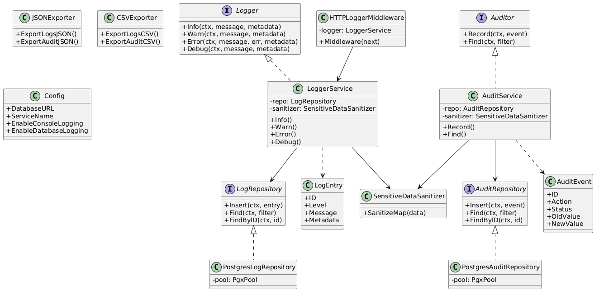
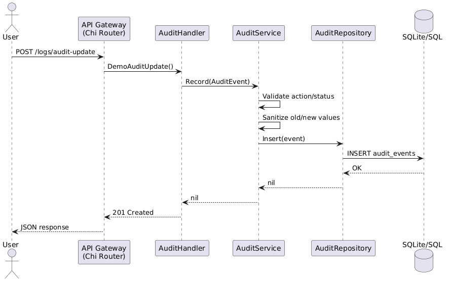
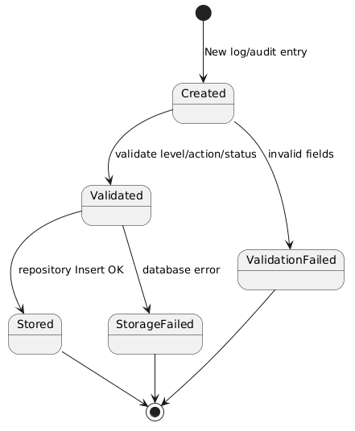
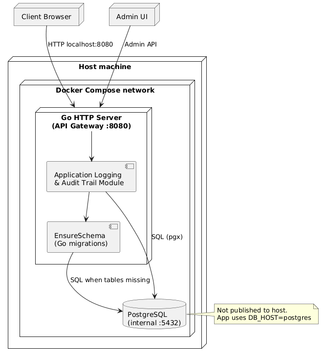

# Component Architecture (Internal / Developer View)

## Design goals

- **Maintainability:** Clear packages (`logger`, `audit`, `handler`) with interfaces
- **Testability:** Repository interfaces + mock implementations for unit tests
- **Safety:** Sanitizer applied before persistence; parameterized SQL only

## Layered architecture

```
HTTP (chi) → Handlers → Services → Repositories → SQLite or PostgreSQL
                ↓
           Middleware → LoggerService
```

Shared utilities live in `internal/common` (pagination, JSON helpers).

## Application startup (database)

On `app.New()`:

1. Read `DB_DRIVER` (`sqlite` default, or `postgres`) from `internal/config`
2. **SQLite:** open `SQLITE_PATH`, ping, check `sqlite_master`, run embedded `V1_1_sqlite` SQL if needed
3. **PostgreSQL:** build DSN from `DB_*`, connect pool, check `information_schema`, run embedded `V1_1` SQL if needed
4. If **both tables exist** → skip migrations
5. If **missing** and `DB_AUTO_MIGRATE=true` → run embedded migration for the active driver
6. If missing and `DB_AUTO_MIGRATE=false` → fail fast

**Docker Compose (default):** app-only with SQLite on a volume; port 8080 published. **Postgres overlay:** `docker-compose.postgres.yml` adds internal PostgreSQL. Go migrations on startup — Flyway optional for Postgres (`make migrate-up`).

## Diagrams

### Class diagram

Source: [diagrams/class_diagram.puml](diagrams/class_diagram.puml)



Shows interfaces (`Logger`, `LogRepository`, `Auditor`, `AuditRepository`) and concrete implementations (`LoggerService`, `PostgresLogRepository`, `SQLiteLogRepository`, etc.).

### Sequence diagram — user updates a resource

Source: [diagrams/sequence_diagram.puml](diagrams/sequence_diagram.puml)



Flow: Client → API Gateway → AuditHandler → AuditService (validate, sanitize) → AuditRepository → database.

### State diagram — log/audit entry lifecycle

Source: [diagrams/state_diagram.puml](diagrams/state_diagram.puml)



States: Created → Validated → Stored, with failure paths ValidationFailed and StorageFailed.

### Deployment diagram

Source: [diagrams/deployment_diagram.puml](diagrams/deployment_diagram.puml)



Docker deployment: Browser/Admin UI → Go HTTP Server on host :8080 → SQLite volume (default) or internal PostgreSQL (overlay); Go `EnsureSchema` on app start when tables are missing.

## Inner workings

1. **HTTP request** enters chi router; middleware wraps response writer and assigns request ID.
2. **Handler** parses query/body, builds filters with `common.Pagination`.
3. **Service** validates enums, sanitizes maps, assigns UUID and timestamp.
4. **Repository** marshals JSONB and executes parameterized INSERT/SELECT.
5. **Export** loads filtered rows and encodes JSON or CSV in memory.

## Regenerating PNG diagrams

```bash
make diagrams
```

Requires Docker (PlantUML image) or local PlantUML JAR.
